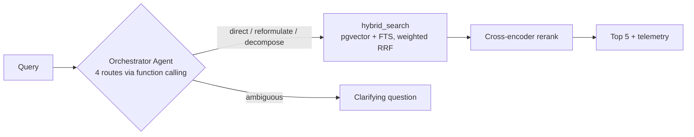

# PicSearch Pro

> Production-grade image semantic search — **hybrid retrieval · agentic orchestration · cross-encoder reranking · evaluation framework** — running entirely on free tiers.

**Status:** Phase 0 (architecture + scaffold) — see the [implementation plan](./docs/07-implementation-plan.md).

## The thesis

Most RAG demos are static pipelines that *assert* quality. This project *measures* it: an in-app benchmark compares four retrieval strategies (vector-only → hybrid → +rerank → +orchestrator agent) with **MRR** and **Recall@K**, isolating what each layer actually contributes — including the agent's.



## Stack

| Layer | Tech |
|---|---|
| Frontend | React 19 · Vite 7 · Tailwind CSS v4 · TanStack Query — Cloudflare Pages |
| API | Hono 4 on Cloudflare Workers (TypeScript, strict) |
| AI | Cloudflare Workers AI behind AI Gateway: Llama 4 Scout (vision) · bge-small-en-v1.5 (embeddings) · GLM-4.7-Flash (agent) · bge-reranker-base (rerank) |
| Data | Supabase Postgres (pgvector HNSW + tsvector GIN + RRF fusion in SQL) · Supabase Storage |
| Contracts | Zod schemas in `packages/shared` — one source of truth for both apps |
| Quality | ESLint 9 (type-checked) · Prettier · Vitest · GitHub Actions · [AGENTS.md](./AGENTS.md)-governed AI development |

Every significant choice has an [ADR](./docs/adr/).

## Quick start

```bash
corepack enable                 # Node >= 22
pnpm install
pnpm dev                        # web :5173 (proxies /api) · api :8787
```

Full setup (Supabase project, secrets, deploy): [docs/07-implementation-plan.md](./docs/07-implementation-plan.md) Phase 1.

```bash
pnpm lint && pnpm typecheck && pnpm test && pnpm build   # the quality gate CI enforces
```

## Repository layout

```
apps/web          React SPA (gallery, search, telemetry, evaluation dashboard)
apps/api          Cloudflare Worker (ingestion, agent, retrieval, benchmark)
packages/shared   Zod contracts, model registry, pure domain logic
supabase/         SQL migrations (schema, indexes, hybrid_search RRF function)
test-dataset/     Benchmark images + ground-truth queries (Phase 5)
docs/             Specs: requirements, architecture, data model, API, agent, evaluation
design/           Claude Design mockup (pending import — docs/08)
```

## Benchmark results

*Published at the end of Phase 5 — table of MRR / Recall@3 / Recall@5 per strategy, with the C vs D comparison isolating the agent's measured contribution.*

## License

[MIT](./LICENSE)
