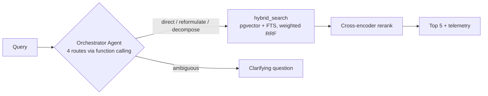

# PicSearch Pro

> Production-grade image semantic search — **hybrid retrieval · agentic orchestration · cross-encoder reranking · evaluation framework** — running entirely on free tiers.

**Status:** Feature-complete (Phases 1–6 implemented) — see the [implementation plan](./docs/07-implementation-plan.md). To run it yourself: [setup guide](./docs/09-setup-guide.md) → [deployment guide](./docs/10-deployment.md).

## The thesis

Most RAG demos are static pipelines that _assert_ quality. This project _measures_ it: an in-app benchmark compares four retrieval strategies (vector-only → hybrid → +rerank → +orchestrator agent) with **MRR** and **Recall@K**, isolating what each layer actually contributes — including the agent's.



## Stack

| Layer     | Tech                                                                                                                                                  |
| --------- | ----------------------------------------------------------------------------------------------------------------------------------------------------- |
| Frontend  | React 19 · Vite 7 · Tailwind CSS v4 · TanStack Query — Cloudflare Pages                                                                               |
| API       | Hono 4 on Cloudflare Workers (TypeScript, strict)                                                                                                     |
| AI        | Cloudflare Workers AI behind AI Gateway: Llama 4 Scout (vision) · bge-small-en-v1.5 (embeddings) · GLM-4.7-Flash (agent) · bge-reranker-base (rerank) |
| Data      | Supabase Postgres (pgvector HNSW + tsvector GIN + RRF fusion in SQL) · Supabase Storage                                                               |
| Contracts | Zod schemas in `packages/shared` — one source of truth for both apps                                                                                  |
| Quality   | ESLint 9 (type-checked) · Prettier · Vitest · GitHub Actions · [AGENTS.md](./AGENTS.md)-governed AI development                                       |

Every significant choice has an [ADR](./docs/adr/).

## Quick start

```bash
corepack enable                 # Node >= 22
pnpm install
pnpm lint && pnpm format:check && pnpm typecheck && pnpm test && pnpm build   # quality gate — needs no cloud creds
```

The quality gate runs fully offline (AI/DB bindings are mocked). To run the **live**
app you need a free Supabase project and a Cloudflare AI Gateway — follow the
**[setup guide](./docs/09-setup-guide.md)** (accounts, migrations, secrets), then:

```bash
cp apps/api/.dev.vars.example apps/api/.dev.vars   # fill in your keys
pnpm dev                        # web :5173 (proxies /api) · api :8787
pnpm seed                       # ingest test-dataset/ for the benchmark (needs SEED_KEY)
```

Deploy to a public URL at $0/month: **[deployment guide](./docs/10-deployment.md)**.

## Repository layout

```
apps/web          React SPA (gallery, search, telemetry, evaluation dashboard)
apps/api          Cloudflare Worker (ingestion, agent, retrieval, benchmark)
packages/shared   Zod contracts, model registry, pure domain logic
supabase/         SQL migrations (schema, indexes, hybrid_search RRF function)
test-dataset/     Benchmark images + ground-truth queries (Phase 5)
docs/             Specs: requirements, architecture, data model, API, agent, evaluation
```

## Benchmark results

_Published at the end of Phase 5 — table of MRR / Recall@3 / Recall@5 per strategy, with the C vs D comparison isolating the agent's measured contribution._

## License

[MIT](./LICENSE)
