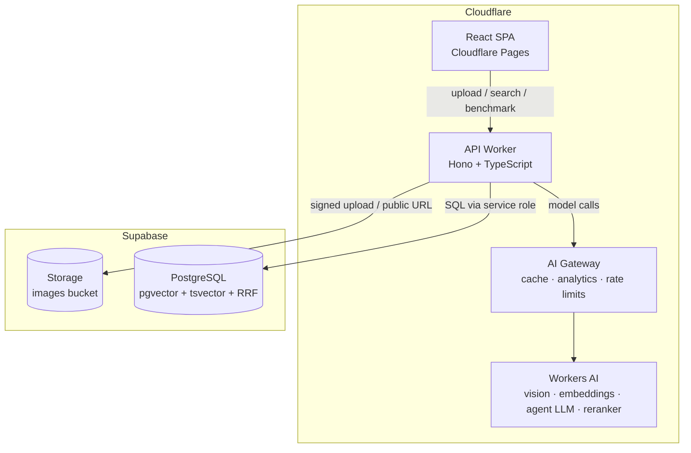
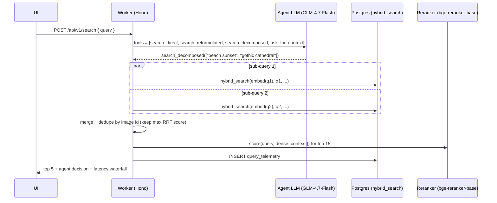

# System Architecture

## 1. High-level diagram

**Ingestion flow:** upload → Storage → Worker orchestrates vision extraction → normalizer builds `dense_context` → embedding → single row insert (metadata + vector + generated tsvector).

**Search flow:** query → **orchestrator agent** (function calling, picks 1 of 4 routes) → `hybrid_search` (1..n times) → merge/dedupe → cross-encoder rerank → top 5 + full telemetry.

## 2. Components

| Component        | Technology                          | Notes                                                                                                                             |
| ---------------- | ----------------------------------- | --------------------------------------------------------------------------------------------------------------------------------- |
| Frontend         | React 19 + Vite 7 + Tailwind CSS v4 | SPA on Cloudflare Pages. Tailwind v4 CSS-first config (`@theme`), no `tailwind.config.js`. TanStack Query for server state.       |
| API              | Cloudflare Worker + Hono 4          | Single Worker, routes under `/api/v1`. Zod-validated boundaries via shared schemas.                                               |
| AI Gateway       | Cloudflare AI Gateway               | Sits in front of all Workers AI calls: response caching (big win for benchmark re-runs), analytics, rate limiting, retries. Free. |
| Database         | Supabase Postgres + pgvector        | HNSW (cosine) + GIN (FTS) indexes; RRF fusion in one SQL function; RLS on.                                                        |
| Storage          | Supabase Storage                    | Public-read bucket, server-side validated uploads.                                                                                |
| Shared contracts | `packages/shared` (Zod 4)           | One source of truth for API types, `ImageMetadata`, env schema, model IDs.                                                        |

## 3. Model selection (Workers AI, verified July 2026)

All models run on the Workers AI free tier and are referenced only via `packages/shared/src/models.ts` (NFR-7).

| Role               | Model                                     | Rationale                                                                                                                                                                                                    |
| ------------------ | ----------------------------------------- | ------------------------------------------------------------------------------------------------------------------------------------------------------------------------------------------------------------ |
| Vision (ingestion) | `@cf/meta/llama-4-scout-17b-16e-instruct` | Natively multimodal MoE, JSON mode for schema-constrained output. Replaces the originally spec'd Llama 3.2 11B Vision (still available as fallback, but older generation).                                   |
| Embeddings         | `@cf/baai/bge-small-en-v1.5`              | 384-dim → small index, fast HNSW, low storage. Battle-tested for English retrieval. `EMBEDDING_DIM = 384` is a shared constant used by schema, SQL and code.                                                 |
| Orchestrator agent | `@cf/zai-org/glm-4.7-flash`               | Fast multilingual model with multi-turn tool calling — Cloudflare's own recommended replacement for legacy small models; low decision latency (NFR-2). Fallback: `@cf/meta/llama-3.3-70b-instruct-fp8-fast`. |
| Reranker           | `@cf/baai/bge-reranker-base`              | True cross-encoder (query + passage jointly scored). On-platform: no external API key, no extra vendor (ADR-0005).                                                                                           |

Deprecation hygiene: Cloudflare deprecated 18 legacy models on 2026-05-30 (all Llama-3/3.1 base variants, Mistral v0.1/0.2, etc.). None of the selected models are on that list.

## 4. Key design decisions (see ADRs for full context)

- **ADR-0001** — pnpm monorepo (`apps/web`, `apps/api`, `packages/shared`).
- **ADR-0002** — All inference on Cloudflare Workers AI behind AI Gateway (zero-cost, one vendor, no key sprawl).
- **ADR-0003** — Hybrid retrieval fused in-database with weighted RRF (single round trip, testable in SQL).
- **ADR-0004** — Agent-first query orchestration with exactly 4 tool-defined routes (Adaptive RAG pattern).
- **ADR-0005** — On-platform cross-encoder reranking (bge-reranker-base) over external APIs (Cohere/Jina).
- **ADR-0006** — AI-driven development governed by `AGENTS.md` (single canonical rules file; `CLAUDE.md` delegates to it).

## 5. Request lifecycle (search, decomposed route example)

## 6. Error handling & resilience

- LLM output is untrusted: vision JSON and agent tool calls are Zod-parsed; one retry with error feedback, then fail with a typed error (NFR-4).
- Every stage wrapped in a `timed()` helper that feeds telemetry and structured logs.
- AI Gateway provides caching and retry; Worker adds a per-stage timeout budget (agent 5 s, rerank 3 s, total 10 s).
- Rerank latency: the cross-encoder scores a compact purpose-built document (`buildRerankContext`: scene, style, setting, objects, keywords — capped at `RETRIEVAL.rerankContextChars`) instead of the full `dense_context` (cross-encoder cost is quadratic in length). Decomposed sub-queries embed + retrieve concurrently.
- Degradation ladder: reranker fails → return RRF order (flagged in response); agent fails → fall back to `search_direct`. Search never hard-fails because an optional layer did.

## 7. Security model

- Browser ↔ Worker only. Service-role key is a Worker secret (`wrangler secret`), never in the client bundle or repo.
- RLS enabled on `images` and `query_telemetry`; anon role has no direct table access — everything goes through the Worker.
- Upload validation server-side: MIME allow-list, 10 MB cap, randomized object names.
- CORS locked to the Pages origin; basic per-IP rate limit on `/search` and `/ingest`.
