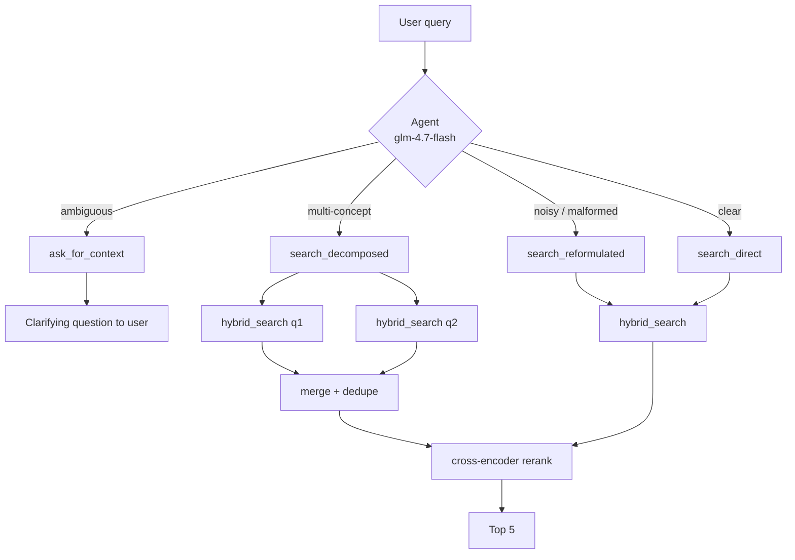

# Orchestrator Agent Design

The differentiator vs. a static RAG pipeline: queries never hit `hybrid_search` directly. A lightweight LLM with **function calling** decides _how_ to resolve each query first (the 2026 "Adaptive RAG" routing pattern). The agent is an orchestration layer on top of retrieval — ingestion and `hybrid_search` don't change.

## 1. Routes



| Route                 | Trigger                                       | Example                                       | Action                                                                                                |
| --------------------- | --------------------------------------------- | --------------------------------------------- | ----------------------------------------------------------------------------------------------------- |
| `search_direct`       | Clear, specific                               | "canal with medieval timber-framed houses"    | Pass through unchanged — zero added overhead                                                          |
| `search_reformulated` | Noisy, typos, vague phrasing but clear intent | "that pic i took in frnace last summr"        | Rewrite into a clean, semantically rich query                                                         |
| `search_decomposed`   | 2+ independent concepts                       | "a beach sunset but also gothic architecture" | Split into 2–3 sub-queries, each independently retrievable; merge + dedupe (keep max score per image) |
| `ask_for_context`     | Cannot form a retrievable query               | "something nice from vacation"                | Return a clarifying question; no DB call                                                              |

## 2. Tool schemas (function calling)

Defined once in `packages/shared` as Zod, converted to JSON Schema for the model:

```ts
search_direct:       { }                                    // no args
search_reformulated: { reformulatedQuery: string }          // min 3 chars
search_decomposed:   { subQueries: string[] }               // 2..3 items, each independently retrievable
ask_for_context:     { question: string }                   // one short question, offer 2-3 concrete options
```

The model MUST call exactly one tool (`tool_choice: "required"`). The tool-call arguments are Zod-parsed; on parse failure the call is retried once with the validation error appended; on second failure → `agent_fallback` route = `search_direct` with the raw query (degradation, never a 500).

## 3. System prompt (summary — canonical version lives in `apps/api/src/agent/prompt.ts`)

Instructs the model to: classify the query into one of the four routes using the decision table above; prefer `search_direct` when in doubt (cheapest, and the benchmark punishes needless intervention); keep reformulations faithful to intent (no invented details); make sub-queries self-contained; never answer the query itself — only route it. Temperature 0.1, max ~200 output tokens.

## 4. Guardrails & budgets

- Decision timeout: 3 s → fallback to `search_direct` (`agent_action = 'agent_fallback'`).
- Decomposition capped at 3 sub-queries (latency + free-tier budget).
- One clarification round max: a follow-up to `ask_for_context` is concatenated with the original query and re-routed, but `ask_for_context` is disabled on that second pass.
- Prompt-injection stance: the query is data, not instructions; the agent's only output channel is a constrained tool call, and its arguments are validated before use.

## 5. Telemetry (closes the loop with evaluation)

Every decision logs `agent_action`, `resolved_queries`, `agent_decision_ms`, `tokens_used`, `model_provider` (FR-11). The benchmark's C vs D comparison (06-evaluation.md) then measures whether reformulate/decompose actually lift MRR/Recall versus bypassing the agent — the agent must _earn_ its latency.
